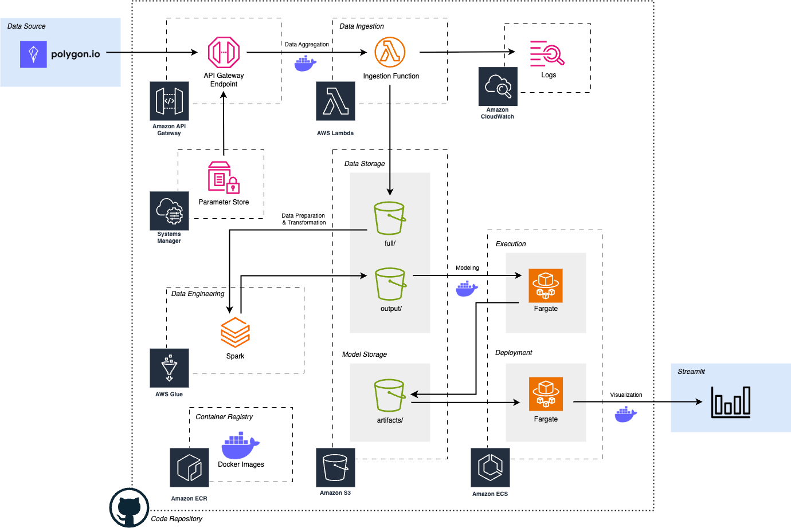

# ⏳ Chronos: Language of time Series

This project presents an end-to-end pipeline for extracting stock data from [Polygon](https://polygon.io/),
and applying time series forecasting using [Chronos](https://github.com/amazon-science/chronos-forecasting),
a model developed by Amazon. It consists of modular microservices deployed on AWS, forming a proof-of-concept (POC)
architecture designed to evaluate Chronos's effectiveness in predicting stock prices.

---

## ⚙️ Quick Start

Each folder in this repository represents a part of a monolithic end-to-end service. The following guide applies to each
of the microservices when creating virtual environment.

### Prerequisite

1. Python 3.11 or newer
2. `uv` package manager installed (recommended). Follow quick [installation](https://docs.astral.sh/uv/getting-started/installation/) guide.

### Getting Started

Clone this repository to local machine and `cd` into the desire microservice.

```shell
git clone git@github.com:LabSixth/cloud-engineering.git
cd <your choice of microservice>
```

Using your choice of package manager, create a virtual environment and install the dependencies for this project.

*Virtual Environment Using `uv`*

`uv sync` creates the virtual environment and install the dependencies for this project at the same time.

```shell
uv sync
source .venv/bin/activate
```

*Virtual Environment Using `pip`*

Alternatively, `pip` can be used to create the virtual environment and install the dependencies for this project.

```shell
# For Linux and MacOS
python3 -m venv .venv
source .venv/bin/activate
pip install -r requirements.txt

# For Windows
py -m venv .venv
.venv\Scripts\activate
pip install -r requirements.txt
```

---

## 🔎 Quick Exploratory Analysis

The exploratory data analysis on Apple's 2024 stock data reveals strong linear relationships among all price-related variables
(`afterHours`, `close`, `high`, `low`, `open`, and `preMarket`). These variables exhibit highly similar upward trends over time
and display nearly identical bimodal distributions, indicating a consistent underlying pattern in the company's stock price 
movement throughout the year. The dataset contains no missing values, ensuring data integrity and reliability.

In contrast, `volume` behaves independently, showing weak negative correlations with price variables and irregular spikes,
suggesting it is influenced more by discrete market events than by price trajectories.

---

## 🏛️ Architecture

We have deployed Chronos in an end-to-end AWS pipeline using S3 for data storage, ECS for model training and inference,
and Lambda for data ingestion. CloudWatch handled logging and monitoring, while IAM roles managed secure access across services.
This setup enabled a scalable and modular environment for testing Chronos as a proof of concept.
Additionally, we deployed a Streamlit application using ECS Fargate to visualize model outputs and interact with predictions in real-time.



---

## 🚀 Contributions

This project would not have been possible without the dedication, collaboration, and contributions of everyone involved.
A heartfelt thank you to all the contributors who helped make this project a success.

- [Yuxuan Huang](https://github.com/Eleanorhhhyxz)
- [Moyi Li](https://github.com/Moyi-Li)
- [Mingsha Mo](https://github.com/monicamomingsha)
- [Yee Jun Ow](https://github.com/YeeJunOw19)
- [Tianyi Zhang](https://github.com/th3ch103)

---

## 📑 Citation

```bibtex
@article{ansari2024chronos,
  title={Chronos: Learning the Language of Time Series},
  author={Ansari, Abdul Fatir and Stella, Lorenzo and Turkmen, Caner and Zhang, Xiyuan, and Mercado, Pedro and Shen, Huibin and Shchur, Oleksandr and Rangapuram, Syama Syndar and Pineda Arango, Sebastian and Kapoor, Shubham and Zschiegner, Jasper and Maddix, Danielle C. and Mahoney, Michael W. and Torkkola, Kari and Gordon Wilson, Andrew and Bohlke-Schneider, Michael and Wang, Yuyang},
  journal={Transactions on Machine Learning Research},
  issn={2835-8856},
  year={2024},
  url={https://openreview.net/forum?id=gerNCVqqtR}
}
```